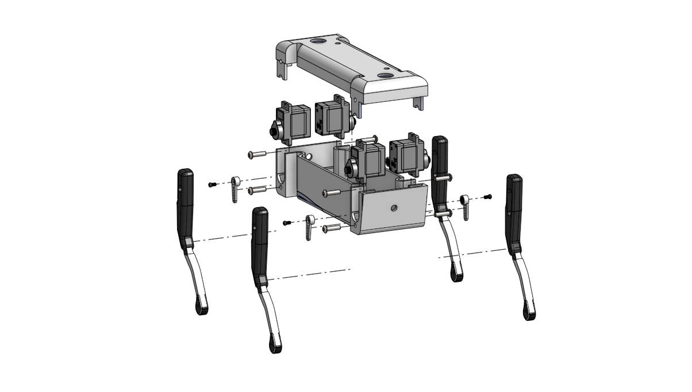

# The exploded view of the dog robot

🔗 **Link Share:** [Click here to view on Onshape](https://cad.onshape.com/documents/ae5a354c48e22b64fa4cae2e/w/1792c1ec13ca1807bd858742/e/c091af73ba2111fed0a84d60?explodedView=MPd8FNScPHJQ8SCYN&renderMode=0&uiState=6a791260ad16c6062cb342c6)
---
# 🐕 The logarithm to build the robot dog

## Phase 1: The Hardware 

1. **Design or Print the Chassis:** You can 3D print open-source models like the SpotMicro or Pupper, or build a frame out of lightweight materials like aluminum or acrylic.
2. **Select the Actuators:** A standard robot dog needs 12 motors (3 per leg) to achieve full 3D movement. Micro-servos (like SG90s) work for small, lightweight builds, while larger brushless DC motors are needed for heavier, more dynamic dogs.
3. **Assemble the Legs:** Each leg usually requires three joints: the shoulder (hip roll), the hip (pitch), and the knee.
## Phase 2: The Brains 

1. **Choose a Microcontroller:** An Arduino Mega, ESP32, or a Teensy is great for handling the real-time motor signals. Many builders also add a Raspberry Pi to handle high-level logic (like computer vision or AI).  Add a 2
2. **Motor Controller:** A PWM (Pulse Width Modulation) driver board will allow your microcontroller to talk to all 12 servos simultaneously without overloading its pins.
3. **Power Delivery:** Motors draw a lot of current. You will need a high-discharge battery (like a LiPo battery) and a voltage step-down converter (buck converter) to power the servos without frying your electronics.
4. **Sensors:** Add an IMU (Inertial Measurement Unit) so the dog knows if it is tilting, and ultrasonic sensors so it can "see" obstacles.
## Phase 3: The Software 

1. **Write the Inverse Kinematics (IK):** If you want the robot's foot to move to a specific coordinate (X, Y, Z), an IK algorithm calculates the exact angles the shoulder, hip, and knee motors need to be at to reach that spot.
2. **Program the Gait:** A "gait" is the sequence of leg movements. For a basic walk (a "creep" gait), the robot moves one leg at a time while keeping its center of gravity over the other three legs. A "trot" gait moves diagonal pairs of legs simultaneously.
3. **Implement Balance Control:** Use the data from the IMU sensor to adjust the leg heights in real-time. If the robot detects it is leaning forward, the code should tell the front legs to push up to keep the chassis level.
4. **Add Remote Control:** Write a script to take inputs from a Bluetooth gamepad or a smartphone app so you can drive the robot around.
